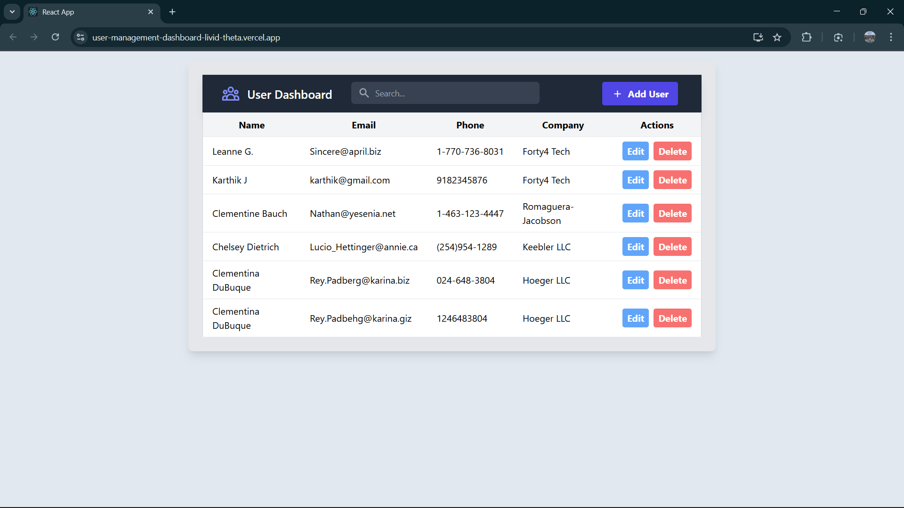
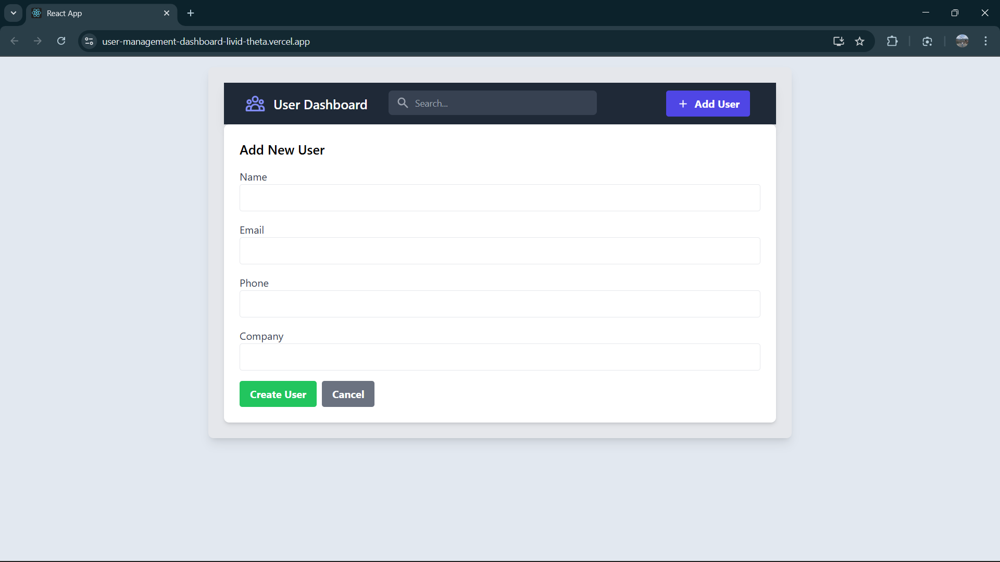
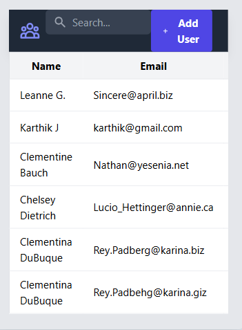

# User Management Dashboard

A full-stack web application built with React and Node.js that allows users to perform CRUD (Create, Read, Update, Delete) operations on a user list. This project was built as the full-stack assignment for Forty4 Tech.

**[https://user-management-dashboard-livid-theta.vercel.app/]** 

---

## Features

-   **Create, Read, Update, and Delete Users**: Full CRUD functionality for user management.
-   **Clean User Interface**: A simple, clean interface to view and manage users.
-   **Responsive Design**: The application is designed to be functional on both desktop and mobile devices.
-   **RESTful API**: A backend API built with Node.js and Express to handle all user data operations.

---

## Tech Stack

-   **Frontend**: React.js, React Router, React Context, Axios, Tailwind CSS
-   **Backend**: Node.js, Express.js, SQLite3, CORS, Dotenv
-   **Development Tools**: Postman (for API testing), Nodemon

---

## Screenshots

#### Dashboard - Desktop View


#### User Form - Desktop View


#### Dashboard - Mobile View


---

## Getting Started

Follow these instructions to get a copy of the project up and running on your local machine for development and testing purposes.

### Prerequisites

You must have Node.js and npm installed on your machine.
- [Node.js](https://nodejs.org/) (which includes npm)

### Backend Setup

1.  **Navigate to the backend directory:**
    ```bash
    cd backend
    ```

2.  **Install the dependencies:**
    ```bash
    npm install
    ```

3.  **Set up environment variables:**
    Create a `.env` file in the `backend` root and add the following line:
    ```
    PORT=8080
    ```

4.  **Start the backend server:**
    ```bash
    npm start
    ```
    The server will be running on `http://localhost:8080`.

### Frontend Setup

1.  **Open a new terminal** and navigate to the frontend directory:
    ```bash
    cd frontend
    ```

2.  **Install the dependencies:**
    ```bash
    npm install
    ```

3.  **Start the React development server:**
    ```bash
    npm start
    ```
    The application will be running on `http://localhost:3000`.

---

## API Endpoints

The backend server provides the following RESTful API endpoints:

| Method | Endpoint          | Description                 |
| :----- | :---------------- | :-------------------------- |
| `GET`    | `/api/users`      | Get all users               |
| `GET`    | `/api/users/:id`  | Get a single user by ID     |
| `POST`   | `/api/users`      | Create a new user           |
| `PUT`    | `/api/users/:id`  | Update an existing user     |
| `DELETE` | `/api/users/:id`  | Delete a user               |
